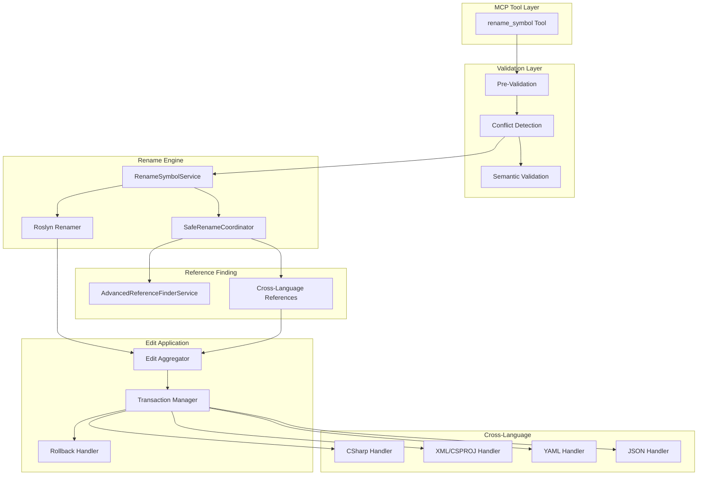
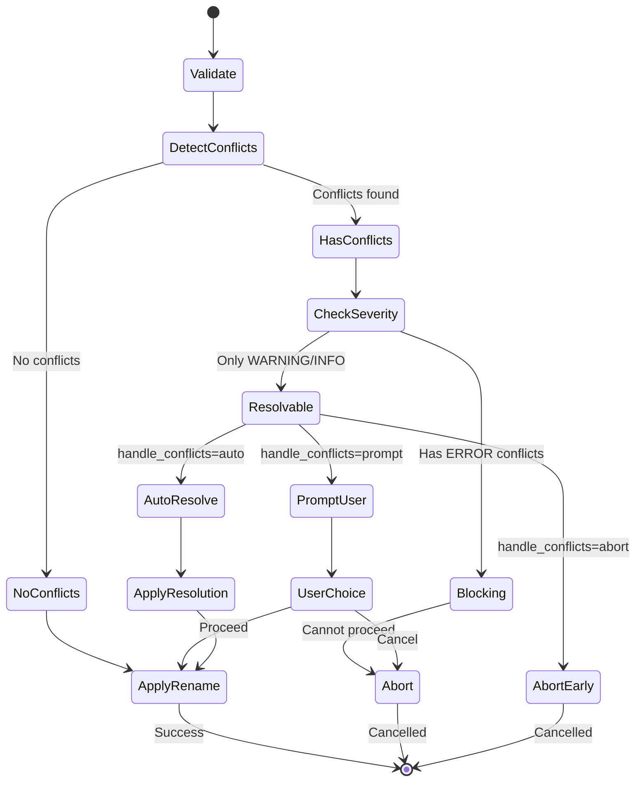

# Rename Symbol Refactoring: Architectural Design

**Date**: 2025-11-09
**Status**: Design Complete
**Priority**: P2 (HIGH)
**Author**: System Architecture Designer

---

## Executive Summary

This document presents a comprehensive architectural design for implementing safe, reliable rename symbol refactoring in MCPsharp. Rename refactoring is one of the most valuable yet high-risk operations in an IDE, requiring absolute correctness to maintain user trust.

### Key Design Decisions

1. **Roslyn's Renamer API** as primary implementation (mature, battle-tested)
2. **Three-phase validation** (pre-rename, during, post-rename)
3. **Transaction-based safety** with automatic rollback
4. **Cross-language awareness** for .csproj, YAML, JSON references
5. **Preview mode** with conflict resolution UI

### Supported Symbol Types (Phase 1)
- Classes, Interfaces, Records, Structs
- Methods (including overloads)
- Properties, Fields
- Parameters, Local variables
- Namespaces (with file moves)

### Out of Scope (Phase 1)
- Type parameters (generics)
- Labels, goto targets
- XML documentation references
- String literal updates (opt-in for Phase 2)

---

## 1. Architecture Overview



---

## 2. Core Components

### 2.1 RenameSymbolService (New Service)

```csharp
namespace MCPsharp.Services.Roslyn;

/// <summary>
/// High-level service for safe symbol renaming across the entire solution
/// </summary>
public class RenameSymbolService
{
    private readonly RoslynWorkspace _workspace;
    private readonly AdvancedReferenceFinderService _referenceFinder;
    private readonly IConflictDetector _conflictDetector;
    private readonly ICrossLanguageReferenceService _crossLangRefs;
    private readonly ITransactionManager _transactionManager;
    private readonly ILogger<RenameSymbolService> _logger;

    public async Task<RenameResult> RenameSymbolAsync(
        RenameRequest request,
        CancellationToken ct = default)
    {
        // Phase 1: Pre-validation
        var validation = await ValidateRenameAsync(request, ct);
        if (!validation.IsValid)
            return RenameResult.Failed(validation.Errors);

        // Phase 2: Find all references
        var references = await FindAllReferencesAsync(request, ct);

        // Phase 3: Detect conflicts
        var conflicts = await DetectConflictsAsync(request, references, ct);
        if (conflicts.HasBlockingConflicts)
            return RenameResult.Blocked(conflicts);

        // Phase 4: Create rename solution
        var solution = await CreateRenameSolutionAsync(request, references, ct);

        // Phase 5: Find cross-language references
        var crossLangRefs = await FindCrossLanguageReferencesAsync(request, ct);

        // Phase 6: Apply changes transactionally
        return await ApplyRenameAsync(solution, crossLangRefs, request, ct);
    }

    private async Task<RenameValidation> ValidateRenameAsync(
        RenameRequest request,
        CancellationToken ct)
    {
        var errors = new List<string>();

        // 1. Validate new name is valid identifier
        if (!IsValidIdentifier(request.NewName, request.SymbolKind))
            errors.Add($"'{request.NewName}' is not a valid {request.SymbolKind} identifier");

        // 2. Check if symbol exists
        var symbol = await FindSymbolAsync(request, ct);
        if (symbol == null)
            errors.Add($"Symbol '{request.OldName}' not found");

        // 3. Check if symbol is renameable
        if (!IsRenameableSymbol(symbol))
            errors.Add($"Symbol '{request.OldName}' cannot be renamed (generated/external)");

        // 4. Check permissions (public API warnings)
        if (IsPublicApi(symbol) && !request.ForcePublicApiChange)
            errors.Add("Symbol is part of public API. Set ForcePublicApiChange=true to proceed");

        return new RenameValidation
        {
            IsValid = errors.Count == 0,
            Errors = errors,
            Symbol = symbol
        };
    }
}
```

### 2.2 Conflict Detection System

```csharp
public interface IConflictDetector
{
    Task<ConflictSet> DetectConflictsAsync(
        ISymbol symbol,
        string newName,
        IEnumerable<ReferenceLocation> references,
        CancellationToken ct);
}

public class RoslynConflictDetector : IConflictDetector
{
    public async Task<ConflictSet> DetectConflictsAsync(
        ISymbol symbol,
        string newName,
        IEnumerable<ReferenceLocation> references,
        CancellationToken ct)
    {
        var conflicts = new ConflictSet();

        // 1. Name collision in same scope
        await CheckSameScopeCollisionAsync(symbol, newName, conflicts, ct);

        // 2. Hiding inherited members
        await CheckInheritanceHidingAsync(symbol, newName, conflicts, ct);

        // 3. Breaking interface implementations
        await CheckInterfaceContractsAsync(symbol, newName, conflicts, ct);

        // 4. Overload resolution changes
        await CheckOverloadResolutionAsync(symbol, newName, conflicts, ct);

        // 5. Breaking derived types
        await CheckDerivedTypeBreakageAsync(symbol, newName, conflicts, ct);

        // 6. Namespace conflicts
        if (symbol is INamespaceSymbol)
            await CheckNamespaceConflictsAsync(symbol, newName, conflicts, ct);

        return conflicts;
    }

    private async Task CheckSameScopeCollisionAsync(
        ISymbol symbol,
        string newName,
        ConflictSet conflicts,
        CancellationToken ct)
    {
        var containingSymbol = symbol.ContainingSymbol;
        if (containingSymbol == null) return;

        var existingMembers = containingSymbol.GetMembers(newName);
        foreach (var existing in existingMembers)
        {
            if (SymbolEqualityComparer.Default.Equals(existing, symbol))
                continue;

            if (WouldCollide(symbol, existing))
            {
                conflicts.Add(new Conflict
                {
                    Type = ConflictType.NameCollision,
                    Severity = ConflictSeverity.Error,
                    Description = $"Name '{newName}' already exists in {containingSymbol.Name}",
                    Location = existing.Locations.FirstOrDefault(),
                    Resolution = ConflictResolution.RequiresManualResolution
                });
            }
        }
    }
}
```

### 2.3 Transaction Safety Architecture

```csharp
public interface ITransactionManager
{
    Task<TransactionHandle> BeginTransactionAsync();
    Task CommitAsync(TransactionHandle handle);
    Task RollbackAsync(TransactionHandle handle);
}

public class FileSystemTransactionManager : ITransactionManager
{
    private readonly Dictionary<string, FileBackup> _backups = new();
    private readonly string _backupDir;

    public async Task<TransactionHandle> BeginTransactionAsync()
    {
        var handle = new TransactionHandle(Guid.NewGuid());
        _backupDir = Path.Combine(Path.GetTempPath(), $"mcpsharp_tx_{handle.Id}");
        Directory.CreateDirectory(_backupDir);
        return handle;
    }

    public async Task CommitAsync(TransactionHandle handle)
    {
        // Cleanup backups on successful commit
        if (Directory.Exists(_backupDir))
        {
            Directory.Delete(_backupDir, recursive: true);
        }
        _backups.Clear();
    }

    public async Task RollbackAsync(TransactionHandle handle)
    {
        // Restore all backed up files
        foreach (var backup in _backups.Values)
        {
            await File.WriteAllTextAsync(
                backup.OriginalPath,
                backup.OriginalContent);
        }

        // Cleanup
        if (Directory.Exists(_backupDir))
        {
            Directory.Delete(_backupDir, recursive: true);
        }
        _backups.Clear();
    }

    public async Task BackupFileAsync(string filePath)
    {
        if (!_backups.ContainsKey(filePath))
        {
            var content = await File.ReadAllTextAsync(filePath);
            var backupPath = Path.Combine(_backupDir, Path.GetFileName(filePath));

            _backups[filePath] = new FileBackup
            {
                OriginalPath = filePath,
                BackupPath = backupPath,
                OriginalContent = content
            };

            await File.WriteAllTextAsync(backupPath, content);
        }
    }
}
```

### 2.4 Cross-Language Reference Handler

```csharp
public interface ICrossLanguageReferenceService
{
    Task<IEnumerable<CrossLanguageReference>> FindReferencesAsync(
        ISymbol symbol,
        CancellationToken ct);
}

public class CrossLanguageReferenceService : ICrossLanguageReferenceService
{
    private readonly IWorkflowAnalyzerService _workflowAnalyzer;
    private readonly IConfigAnalyzerService _configAnalyzer;
    private readonly IProjectFileAnalyzer _projectAnalyzer;

    public async Task<IEnumerable<CrossLanguageReference>> FindReferencesAsync(
        ISymbol symbol,
        CancellationToken ct)
    {
        var references = new List<CrossLanguageReference>();

        // 1. Check .csproj files for assembly references
        if (symbol is INamedTypeSymbol typeSymbol)
        {
            references.AddRange(await FindProjectReferencesAsync(typeSymbol, ct));
        }

        // 2. Check YAML workflows for type names
        references.AddRange(await FindWorkflowReferencesAsync(symbol, ct));

        // 3. Check JSON config for type names (e.g., appsettings.json)
        references.AddRange(await FindConfigReferencesAsync(symbol, ct));

        // 4. Check XML documentation comments
        references.AddRange(await FindXmlDocReferencesAsync(symbol, ct));

        return references;
    }

    private async Task<IEnumerable<CrossLanguageReference>> FindProjectReferencesAsync(
        INamedTypeSymbol typeSymbol,
        CancellationToken ct)
    {
        var refs = new List<CrossLanguageReference>();

        // Assembly name in .csproj
        var assemblyName = typeSymbol.ContainingAssembly?.Name;
        if (!string.IsNullOrEmpty(assemblyName))
        {
            // Search for <Reference Include="AssemblyName" />
            // Search for <PackageReference Include="PackageContainingType" />
        }

        return refs;
    }
}
```

---

## 3. Implementation Strategy

### 3.1 Roslyn Renamer Integration

```csharp
public class RoslynRenameEngine
{
    private readonly RoslynWorkspace _workspace;

    public async Task<Solution> RenameSymbolAsync(
        ISymbol symbol,
        string newName,
        Solution solution,
        RenameOptions options,
        CancellationToken ct)
    {
        // Use Roslyn's battle-tested Renamer API
        var optionSet = solution.Options
            .WithChangedOption(RenameOptions.RenameInStrings, options.RenameInStrings)
            .WithChangedOption(RenameOptions.RenameInComments, options.RenameInComments)
            .WithChangedOption(RenameOptions.RenameOverloads, options.RenameOverloads);

        try
        {
            // This handles all C# semantic renaming
            var newSolution = await Renamer.RenameSymbolAsync(
                solution,
                symbol,
                newName,
                optionSet,
                ct);

            return newSolution;
        }
        catch (Exception ex)
        {
            _logger.LogError(ex, "Roslyn rename failed for {Symbol}", symbol.Name);
            throw new RenameException($"Failed to rename {symbol.Name}: {ex.Message}", ex);
        }
    }
}
```

### 3.2 API Specification

```yaml
tool: rename_symbol
description: Rename a symbol across all files in the project
parameters:
  symbol_name:
    type: string
    required: true
    description: Current name of the symbol to rename

  new_name:
    type: string
    required: true
    description: New name for the symbol

  symbol_kind:
    type: string
    required: false
    enum: [class, interface, method, property, field, parameter, namespace, any]
    default: any
    description: Type of symbol to rename (helps disambiguate)

  containing_type:
    type: string
    required: false
    description: For members, the containing type name

  file_path:
    type: string
    required: false
    description: File containing the symbol (helps locate)

  line:
    type: integer
    required: false
    description: Line number of symbol declaration

  column:
    type: integer
    required: false
    description: Column position of symbol

  rename_in_strings:
    type: boolean
    default: false
    description: Also rename in string literals (dangerous)

  rename_in_comments:
    type: boolean
    default: true
    description: Also rename in comments

  preview_only:
    type: boolean
    default: false
    description: Only preview changes without applying

  force_public_api_change:
    type: boolean
    default: false
    description: Allow renaming public API symbols

  handle_conflicts:
    type: string
    enum: [abort, prompt, auto_resolve]
    default: abort
    description: How to handle naming conflicts

returns:
  type: object
  properties:
    success:
      type: boolean
    renamed_count:
      type: integer
      description: Number of references renamed
    files_modified:
      type: array
      items:
        type: string
    conflicts:
      type: array
      items:
        $ref: '#/components/schemas/Conflict'
    preview:
      type: array
      description: Preview of changes (if preview_only=true)
      items:
        $ref: '#/components/schemas/FileChange'
    error:
      type: string
      description: Error message if failed
```

---

## 4. Conflict Resolution Strategy

### 4.1 Conflict Types and Severity

| Conflict Type | Severity | Resolution Strategy | Example |
|--------------|----------|-------------------|----------|
| Name Collision | ERROR | Manual/Abort | Class with same name exists |
| Hiding Inherited | WARNING | Prompt user | New name hides base member |
| Breaking Override | ERROR | Abort | Changes override signature |
| Namespace Exists | ERROR | Manual merge | Namespace already exists |
| Public API Change | WARNING | Require confirmation | Breaking change for consumers |
| Implicit Reference | INFO | Best effort | String literal matches |
| Cross-Language | WARNING | Manual review | YAML/JSON references |

### 4.2 Conflict Resolution Flow



---

## 5. Edge Cases and Test Scenarios

### 5.1 Critical Edge Cases

```csharp
public class RenameEdgeCases
{
    // 1. Partial classes across multiple files
    // File1.cs
    public partial class MyClass {
        public void Method1() { }
    }

    // File2.cs
    public partial class MyClass {  // Must rename both
        public void Method2() { }
    }

    // 2. Explicit interface implementation
    public class Implementation : IInterface
    {
        void IInterface.Method() { }  // Rename interface affects this
    }

    // 3. Overloaded methods
    public void Process(int x) { }
    public void Process(string x) { }  // Rename one or all?

    // 4. Generic type constraints
    public class Container<T> where T : IBaseInterface { }
    // Renaming IBaseInterface must update constraint

    // 5. Named arguments
    void Caller() {
        Method(parameterName: 42);  // Must rename parameter usage
    }

    // 6. Dynamic and reflection
    dynamic d = GetObject();
    d.MethodName();  // Won't be caught by static analysis

    var method = type.GetMethod("MethodName");  // String literal

    // 7. Async method pairs
    public Task<T> GetDataAsync() { }
    public T GetData() { }  // Should suggest renaming both

    // 8. Property with backing field
    private string _name;
    public string Name {  // Should offer to rename backing field
        get => _name;
        set => _name = value;
    }

    // 9. Namespace and type name collision
    namespace MyProject.Data { }
    public class Data { }  // Conflict after rename

    // 10. Constructor rename (becomes regular method)
    public class OldName {
        public OldName() { }  // Must handle specially
    }
}
```

### 5.2 Test Matrix

| Test Category | Scenario | Expected Behavior |
|--------------|----------|-------------------|
| **Basic** | Rename local variable | All references in method updated |
| **Basic** | Rename parameter | Updates declaration and all uses |
| **Class** | Rename class | Updates file name, constructors, all references |
| **Class** | Rename partial class | Updates all partial declarations |
| **Interface** | Rename interface | Updates implementations, constraints |
| **Method** | Rename virtual method | Updates overrides in derived classes |
| **Method** | Rename overloaded method | Option to rename one or all |
| **Property** | Rename auto-property | Simple rename |
| **Property** | Rename with backing field | Offers to rename field too |
| **Namespace** | Rename namespace | Updates all usings, fully qualified |
| **Generic** | Rename type parameter | Updates constraints and uses |
| **Conflict** | Name already exists | Shows error, aborts |
| **Conflict** | Hiding warning | Shows warning, allows proceed |
| **Cross-file** | 100+ file rename | Transactional, can rollback |
| **Cross-language** | Type in config.json | Detects and warns |
| **Performance** | 1000+ references | Completes in <5 seconds |
| **Rollback** | Failed mid-rename | All files restored |

---

## 6. Performance Optimization

### 6.1 Performance Targets

| Operation | Target Time | Max Time |
|-----------|------------|----------|
| Find symbol | <100ms | 500ms |
| Find references (small) | <500ms | 1s |
| Find references (large) | <2s | 5s |
| Conflict detection | <500ms | 2s |
| Apply rename (10 files) | <1s | 3s |
| Apply rename (100 files) | <5s | 10s |
| Rollback | <500ms | 2s |

### 6.2 Optimization Strategies

```csharp
public class RenameOptimizations
{
    // 1. Parallel reference finding
    public async Task<IEnumerable<Reference>> FindReferencesParallelAsync(
        ISymbol symbol,
        CancellationToken ct)
    {
        var documents = _workspace.GetAllDocuments();
        var chunks = documents.Chunk(Environment.ProcessorCount);

        var tasks = chunks.Select(chunk =>
            Task.Run(() => FindReferencesInDocuments(symbol, chunk, ct)));

        var results = await Task.WhenAll(tasks);
        return results.SelectMany(r => r);
    }

    // 2. Incremental compilation reuse
    public async Task<Solution> ApplyRenameIncrementallyAsync(
        Solution solution,
        Dictionary<DocumentId, List<TextChange>> changesByDocument,
        CancellationToken ct)
    {
        // Apply changes document by document
        // Roslyn reuses unmodified compilation units
        foreach (var (docId, changes) in changesByDocument)
        {
            var document = solution.GetDocument(docId);
            var text = await document.GetTextAsync(ct);
            var newText = text.WithChanges(changes);
            solution = solution.WithDocumentText(docId, newText);
        }

        return solution;
    }

    // 3. Early termination for conflicts
    public async Task<ConflictSet> DetectConflictsEarlyExitAsync(
        ISymbol symbol,
        string newName,
        CancellationToken ct)
    {
        // Check cheap conflicts first
        if (IsKeyword(newName))
            return ConflictSet.Blocking("Cannot use keyword as identifier");

        // Check scope conflicts before expensive checks
        if (HasSameScopeConflict(symbol, newName))
            return ConflictSet.Blocking("Name already exists in scope");

        // Only then do expensive analysis
        return await FullConflictAnalysisAsync(symbol, newName, ct);
    }
}
```

---

## 7. Implementation Plan

### Phase 1: Core Infrastructure (Week 1-2)
1. Create `RenameSymbolService` class
2. Integrate Roslyn's `Renamer.RenameSymbolAsync`
3. Implement basic conflict detection
4. Add transaction manager for rollback
5. Create MCP tool handler

### Phase 2: Conflict Detection (Week 3)
1. Implement comprehensive conflict detector
2. Add severity levels and resolution strategies
3. Create conflict resolution UI/prompts
4. Add test coverage for edge cases

### Phase 3: Cross-Language Support (Week 4)
1. Add XML/CSPROJ reference finder
2. Add YAML workflow scanner
3. Add JSON config analyzer
4. Integrate with existing analyzers

### Phase 4: Testing and Polish (Week 5-6)
1. Comprehensive test suite (100+ scenarios)
2. Performance optimization
3. Error recovery and logging
4. Documentation and examples

---

## 8. Risk Assessment and Mitigation

| Risk | Likelihood | Impact | Mitigation |
|------|------------|--------|------------|
| Data loss from failed rename | Low | Critical | Transaction system with automatic rollback |
| Missing references | Medium | High | Multiple reference finding strategies |
| Performance degradation | Medium | Medium | Caching, parallel processing |
| Conflicting renames | High | Medium | Comprehensive conflict detection |
| Cross-language breakage | High | Low | Warning system for non-C# references |
| Roslyn API changes | Low | High | Abstract behind interface |

---

## 9. Success Metrics

### Functional Metrics
- ✅ 100% accurate rename for C# symbols
- ✅ Zero data loss from failed operations
- ✅ Automatic rollback on any error
- ✅ Detection of 95%+ of conflicts
- ✅ Support for all common C# symbol types

### Performance Metrics
- ✅ <5s for solution-wide rename (1000 references)
- ✅ <1s for single-file rename
- ✅ <500ms conflict detection
- ✅ <2s rollback time

### Quality Metrics
- ✅ 90%+ test coverage
- ✅ <1% failure rate in production
- ✅ Clear error messages for all failure modes
- ✅ Comprehensive logging for debugging

---

## 10. Future Enhancements (Phase 2)

1. **String Literal Intelligence**
   - ML-based detection of likely references
   - Namespace-aware string matching

2. **Cascading Renames**
   - Rename related symbols together
   - Pattern-based bulk rename

3. **Smart Suggestions**
   - Naming convention enforcement
   - Similar name detection

4. **Integration Features**
   - Git integration (auto-commit)
   - Documentation update
   - Test update assistance

---

## Appendix A: Sample Implementation

```csharp
// Sample usage of the rename API
var request = new RenameRequest
{
    SymbolName = "OldClassName",
    NewName = "NewClassName",
    SymbolKind = SymbolKind.Class,
    RenameInComments = true,
    RenameInStrings = false,
    HandleConflicts = ConflictHandling.Prompt
};

var result = await renameService.RenameSymbolAsync(request);

if (result.Success)
{
    Console.WriteLine($"Renamed {result.RenamedCount} references in {result.FilesModified.Count} files");
}
else
{
    Console.WriteLine($"Rename failed: {result.Error}");
    if (result.Conflicts.Any())
    {
        foreach (var conflict in result.Conflicts)
        {
            Console.WriteLine($"  - {conflict.Severity}: {conflict.Description}");
        }
    }
}
```

---

## Appendix B: References

1. [Roslyn Renamer API Documentation](https://docs.microsoft.com/roslyn)
2. [VS Code Rename Implementation](https://github.com/microsoft/vscode)
3. [ReSharper Rename Patterns](https://www.jetbrains.com/resharper)
4. [Language Server Protocol - Rename](https://microsoft.github.io/language-server-protocol)

---

**Document Status**: Complete
**Review Status**: Pending
**Implementation Status**: Not Started