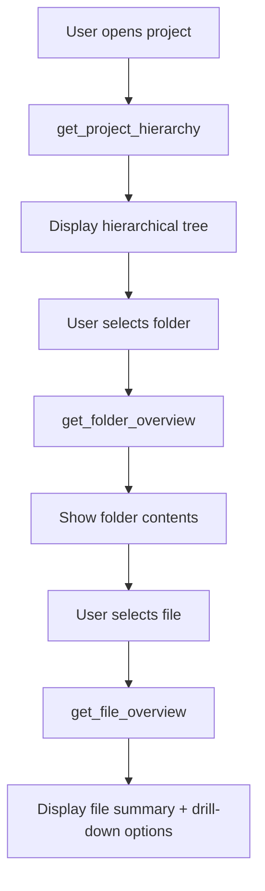
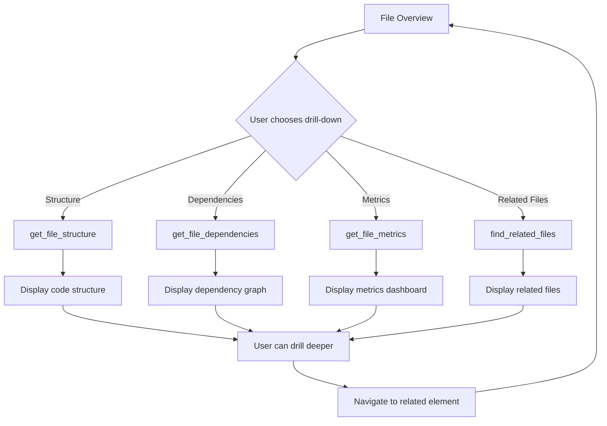

# Smart File Overview System Design

## Overview

This document outlines the design of a smart file overview system for MCPsharp that provides hierarchical drill-down capabilities, enabling users to navigate and understand complex codebases efficiently.

## System Architecture

### Core Components

#### 1. Enhanced File Information Model

```csharp
public class EnhancedFileInfo
{
    // Basic Properties
    public required string Path { get; init; }
    public required string RelativePath { get; init; }
    public required string Name { get; init; }
    public required string Extension { get; init; }
    public long Size { get; init; }
    public DateTime LastModified { get; init; }
    public bool IsHidden { get; init; }
    public FileAttributes Attributes { get; init; }

    // Content Analysis
    public FileType FileType { get; init; }
    public FileCategory Category { get; init; }
    public string? Language { get; init; }
    public int LineCount { get; init; }
    public FileComplexity Complexity { get; init; }

    // Hierarchical Information
    public string? ParentPath { get; init; }
    public List<string> ChildPaths { get; init; } = new();
    public int Depth { get; init; }
    public bool HasChildren => ChildPaths.Any();

    // Semantic Information
    public List<string> Tags { get; init; } = new();
    public string? Namespace { get; init; }
    public List<string> Dependencies { get; init; } = new();
    public List<string> Dependents { get; init; } = new();

    // Quick Summary
    public string? Summary { get; init; }
    public FileStatistics? Statistics { get; init; }

    // Drill-down Availability
    public DrillDownCapabilities AvailableDrillDowns { get; init; } = new();
}

public class DrillDownCapabilities
{
    public bool CanShowStructure { get; init; }
    public bool CanShowDependencies { get; init; }
    public bool CanShowSymbols { get; init; }
    public bool CanShowMetrics { get; init; }
    public bool CanShowHistory { get; init; }
    public bool CanShowRelated { get; init; }
}

public class FileComplexity
{
    public int CyclomaticComplexity { get; init; }
    public int CognitiveComplexity { get; init; }
    public int LinesOfCode { get; init; }
    public int MaintainabilityIndex { get; init; }
    public ComplexityLevel Level { get; init; }
}

public enum ComplexityLevel
{
    Trivial,
    Simple,
    Moderate,
    Complex,
    VeryComplex
}
```

#### 2. Hierarchical Navigation Structure

```csharp
public class HierarchicalFileStructure
{
    public required string RootPath { get; init; }
    public required TreeNode<EnhancedFileInfo> RootNode { get; init; }
    public FileStructureMetadata Metadata { get; init; } = new();
    public List<FilterOption> AvailableFilters { get; init; } = new();
}

public class TreeNode<T>
{
    public required T Value { get; init; }
    public required string Id { get; init; }
    public string? ParentId { get; init; }
    public List<TreeNode<T>> Children { get; init; } = new();
    public TreeLevel Level { get; init; }
    public bool IsExpanded { get; init; }
    public bool IsSelected { get; init; }
}

public enum TreeLevel
{
    Project,
    Folder,
    Namespace,
    Type,
    Member,
    Detail
}

public class FileStructureMetadata
{
    public int TotalFiles { get; init; }
    public int TotalFolders { get; init; }
    public Dictionary<FileCategory, int> CategoryCounts { get; init; } = new();
    public Dictionary<FileType, int> TypeCounts { get; init; } = new();
    public List<string> MostComplexFiles { get; init; } = new();
    public List<string> RecentlyModified { get; init; } = new();
}
```

#### 3. Drill-Down Views

```csharp
// Base view for all drill-downs
public abstract class DrillDownView
{
    public required string ViewType { get; init; }
    public required string FilePath { get; init; }
    public required string Title { get; init; }
    public DateTime GeneratedAt { get; init; } = DateTime.UtcNow;
    public ViewMetadata Metadata { get; init; } = new();
}

// Structure View - Code organization
public class StructureView : DrillDownView
{
    public List<CodeElement> Elements { get; init; } = new();
    public List<Relationship> Relationships { get; init; } = new();
    public StructureLayout Layout { get; init; } = StructureMode.Tree;
}

public class CodeElement
{
    public required string Id { get; init; }
    public required string Name { get; init; }
    public required CodeElementType Type { get; init; }
    public required string SourceFile { get; init; }
    public TextSpan Location { get; init; }
    public List<string> Children { get; init; } = new();
    public List<string> Dependencies { get; init; } = new();
    public Dictionary<string, object> Properties { get; init; } = new();
}

public enum CodeElementType
{
    Namespace,
    Class,
    Interface,
    Struct,
    Enum,
    Method,
    Property,
    Field,
    Event,
    Constructor,
    Parameter
}

// Dependencies View - File relationships
public class DependenciesView : DrillDownView
{
    public List<DependencyGraph> Graphs { get; init; } = new();
    public DependencyAnalysis Analysis { get; init; } = new();
}

public class DependencyGraph
{
    public required string GraphId { get; init; }
    public GraphType Type { get; init; }
    public List<DependencyNode> Nodes { get; init; } = new();
    public List<DependencyEdge> Edges { get; init; } = new();
    public GraphLayout Layout { get; init; } = new();
}

// Metrics View - Code quality metrics
public class MetricsView : DrillDownView
{
    public FileMetrics FileMetrics { get; init; } = new();
    public List<MetricCategory> Categories { get; init; } = new();
    public MetricsTrend? Trend { get; init; }
    public List<MetricAlert> Alerts { get; init; } = new();
}

public class FileMetrics
{
    public SizeMetrics Size { get; init; } = new();
    public ComplexityMetrics Complexity { get; init; } = new();
    public QualityMetrics Quality { get; init; } = new();
    public TestMetrics TestCoverage { get; init; } = new();
}
```

### Tool Implementation

#### 1. Core Navigation Tools

```csharp
// Get enhanced file overview with hierarchical information
[Tool("get_file_overview")]
public async Task<FileOverviewResult> GetFileOverviewAsync(
    string path,
    bool includeSubItems = false,
    int maxDepth = 1,
    OverviewLevel level = OverviewLevel.Standard)
{
    var fileInfo = await GetEnhancedFileInfoAsync(path);

    if (includeSubItems && fileInfo.HasChildren)
    {
        fileInfo.SubItems = await GetSubItemsAsync(path, maxDepth);
    }

    return new FileOverviewResult
    {
        File = fileInfo,
        AvailableDrillDowns = DetermineDrillDownCapabilities(fileInfo),
        RelatedFiles = await FindRelatedFilesAsync(path),
        Suggestions = GenerateSuggestions(fileInfo)
    };
}

// Get hierarchical project structure
[Tool("get_project_hierarchy")]
public async Task<HierarchicalFileStructure> GetProjectHierarchyAsync(
    string? rootPath = null,
    int maxDepth = 3,
    HierarchyFilter[]? filters = null,
    SortBy sortBy = SortBy.Name)
{
    rootPath ??= _projectContext.CurrentProjectPath;

    var rootNode = await BuildHierarchyAsync(rootPath, maxDepth, filters);
    var metadata = await CalculateMetadataAsync(rootPath);

    return new HierarchicalFileStructure
    {
        RootPath = rootPath,
        RootNode = rootNode,
        Metadata = metadata,
        AvailableFilters = GetAvailableFilters(rootPath)
    };
}

// Smart file search with contextual awareness
[Tool("search_files_smart")]
public async Task<SmartSearchResult> SearchFilesAsync(
    string query,
    SearchScope scope = SearchScope.Project,
    SearchMode mode = SearchMode.Semantic,
    int maxResults = 50,
    bool includeContext = true)
{
    var results = new List<SmartSearchMatch>();

    switch (mode)
    {
        case SearchMode.Semantic:
            results = await SemanticSearchAsync(query, scope, maxResults);
            break;
        case SearchMode.Structural:
            results = await StructuralSearchAsync(query, scope, maxResults);
            break;
        case SearchMode.Dependency:
            results = await DependencySearchAsync(query, scope, maxResults);
            break;
        default:
            results = await TextSearchAsync(query, scope, maxResults);
    }

    if (includeContext)
    {
        await EnrichWithContextAsync(results);
    }

    return new SmartSearchResult
    {
        Query = query,
        Matches = results,
        TotalCount = results.Count,
        ExecutionTime = DateTime.UtcNow,
        Suggestions = GenerateSearchSuggestions(query, results)
    };
}
```

#### 2. Drill-Down Tools

```csharp
// Get structural view of a file
[Tool("get_file_structure")]
public async Task<StructureView> GetFileStructureAsync(
    string path,
    StructureDetailLevel detailLevel = StructureDetailLevel.Members,
    bool includePrivate = false,
    bool includeInherited = false)
{
    var fileContent = await _fileOperations.ReadFileAsync(path);
    var syntaxTree = _roslynWorkspace.ParseText(fileContent);

    var root = await syntaxTree.GetRootAsync();
    var elements = await ExtractCodeElementsAsync(root, detailLevel, includePrivate, includeInherited);
    var relationships = await AnalyzeRelationshipsAsync(elements);

    return new StructureView
    {
        ViewType = "Structure",
        FilePath = path,
        Title = $"Structure: {Path.GetFileName(path)}",
        Elements = elements,
        Relationships = relationships,
        Layout = DetermineOptimalLayout(elements),
        Metadata = new ViewMetadata
        {
            ElementCount = elements.Count,
            RelationshipCount = relationships.Count,
            ProcessingTime = DateTime.UtcNow,
            Complexity = CalculateStructuralComplexity(elements)
        }
    };
}

// Get dependency analysis
[Tool("get_file_dependencies")]
public async Task<DependenciesView> GetFileDependenciesAsync(
    string path,
    DependencyType type = DependencyType.All,
    DependencyDirection direction = DependencyDirection.Both,
    int maxDepth = 2)
{
    var dependencies = await AnalyzeDependenciesAsync(path, type, direction, maxDepth);

    return new DependenciesView
    {
        ViewType = "Dependencies",
        FilePath = path,
        Title = $"Dependencies: {Path.GetFileName(path)}",
        Graphs = BuildDependencyGraphs(dependencies),
        Analysis = AnalyzeDependencyPatterns(dependencies),
        Metadata = new ViewMetadata
        {
            ProcessingTime = DateTime.UtcNow,
            NodeCount = dependencies.Nodes.Count,
            EdgeCount = dependencies.Edges.Count
        }
    };
}

// Get file metrics and quality indicators
[Tool("get_file_metrics")]
public async Task<MetricsView> GetFileMetricsAsync(
    string path,
    MetricsCategory[] categories = null,
    bool includeTrends = false)
{
    categories ??= new[] { MetricsCategory.Complexity, MetricsCategory.Quality };

    var metrics = await CalculateMetricsAsync(path, categories);

    return new MetricsView
    {
        ViewType = "Metrics",
        FilePath = path,
        Title = $"Metrics: {Path.GetFileName(path)}",
        FileMetrics = metrics,
        Categories = CategorizeMetrics(metrics),
        Trend = includeTrends ? await GetMetricsTrendAsync(path) : null,
        Alerts = GenerateMetricAlerts(metrics),
        Metadata = new ViewMetadata
        {
            ProcessingTime = DateTime.UtcNow,
            Categories = categories
        }
    };
}
```

#### 3. Intelligent Navigation Tools

```csharp
// Find related files based on code patterns
[Tool("find_related_files")]
public async Task<RelatedFilesResult> FindRelatedFilesAsync(
    string path,
    RelationType[] types = null,
    double minRelevance = 0.3)
{
    types ??= new[] { RelationType.Imports, RelationType.Tests, RelationType.Configuration };

    var relations = new List<FileRelation>();

    foreach (var type in types)
    {
        var typeRelations = await FindRelationsAsync(path, type, minRelevance);
        relations.AddRange(typeRelations);
    }

    return new RelatedFilesResult
    {
        SourceFile = path,
        Relations = relations.OrderByDescending(r => r.Relevance).ToList(),
        Suggestions = GenerateNavigationSuggestions(relations)
    };
}

// Get intelligent file suggestions
[Tool("get_file_suggestions")]
public async Task<FileSuggestions> GetFileSuggestionsAsync(
    string? contextPath = null,
    SuggestionType[] types = null)
{
    types ??= new[] { SuggestionType.Navigation, SuggestionType.Refactoring, SuggestionType.Testing };

    var suggestions = new List<FileSuggestion>();

    foreach (var type in types)
    {
        suggestions.AddRange(await GenerateSuggestionsAsync(type, contextPath));
    }

    return new FileSuggestions
    {
        ContextPath = contextPath,
        Suggestions = suggestions.OrderByDescending(s => s.Priority).Take(20).ToList(),
        GeneratedAt = DateTime.UtcNow
    };
}
```

### User Experience Flow

#### 1. Initial Overview



#### 2. Hierarchical Drill-Down



### Implementation Strategy

#### Phase 1: Core Infrastructure (Week 1-2)
- Implement `EnhancedFileInfo` model
- Create `FileOverviewService`
- Add basic file categorization and tagging
- Implement `get_file_overview` and `get_project_hierarchy`

#### Phase 2: Structure Analysis (Week 2-3)
- Implement `StructureView` and code element extraction
- Integrate with Roslyn for accurate AST parsing
- Add `get_file_structure` with multiple detail levels
- Implement semantic relationship analysis

#### Phase 3: Dependencies and Metrics (Week 3-4)
- Implement dependency analysis and graph visualization
- Add metrics calculation and quality indicators
- Create `DependenciesView` and `MetricsView`
- Implement trend analysis capabilities

#### Phase 4: Intelligence and Suggestions (Week 4-5)
- Add smart search with semantic understanding
- Implement related file detection
- Create intelligent navigation suggestions
- Add contextual recommendations

#### Phase 5: Polish and Optimization (Week 5-6)
- Optimize performance for large codebases
- Add caching for frequently accessed information
- Implement progressive loading for large hierarchies
- Add user preference persistence

### Technical Considerations

#### Performance Optimization
1. **Lazy Loading**: Load child nodes on demand
2. **Caching**: Cache analysis results with file change detection
3. **Streaming**: Use streaming for large file analysis
4. **Parallel Processing**: Analyze multiple files concurrently
5. **Incremental Updates**: Update only changed parts of hierarchy

#### Scalability
1. **Memory Management**: Limit memory usage for large projects
2. **Pagination**: Implement pagination for large result sets
3. **Background Processing**: Perform analysis in background threads
4. **Resource Pooling**: Reuse resources and minimize allocations

#### Integration Points
1. **Existing Services**: Leverage `FileOperationsService`, `StreamingFileProcessor`
2. **Roslyn Integration**: Use existing workspace for semantic analysis
3. **Architecture Validation**: Integrate with existing architecture models
4. **Bulk Operations**: Use existing bulk processing for batch operations

### Success Metrics

1. **Usability**: Users can navigate to any code element within 3 clicks
2. **Performance**: Initial hierarchy loads within 2 seconds
3. **Accuracy**: 95% accuracy in code element detection
4. **Coverage**: Support for 90% of common C# patterns
5. **Extensibility**: Easy to add new drill-down view types

This design provides a comprehensive, hierarchical file overview system that seamlessly integrates with MCPsharp's existing architecture while significantly enhancing the user's ability to understand and navigate complex codebases.